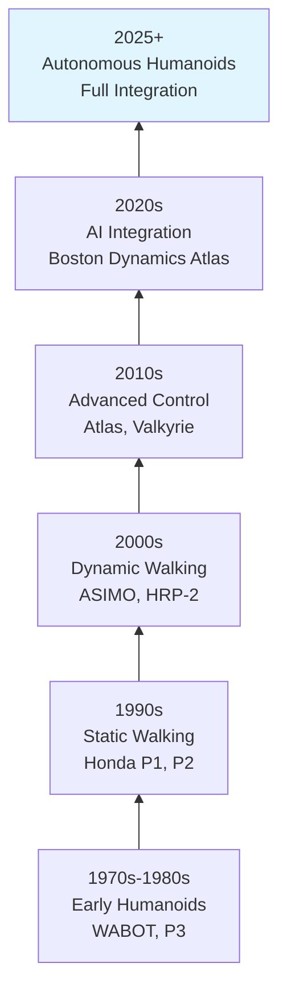
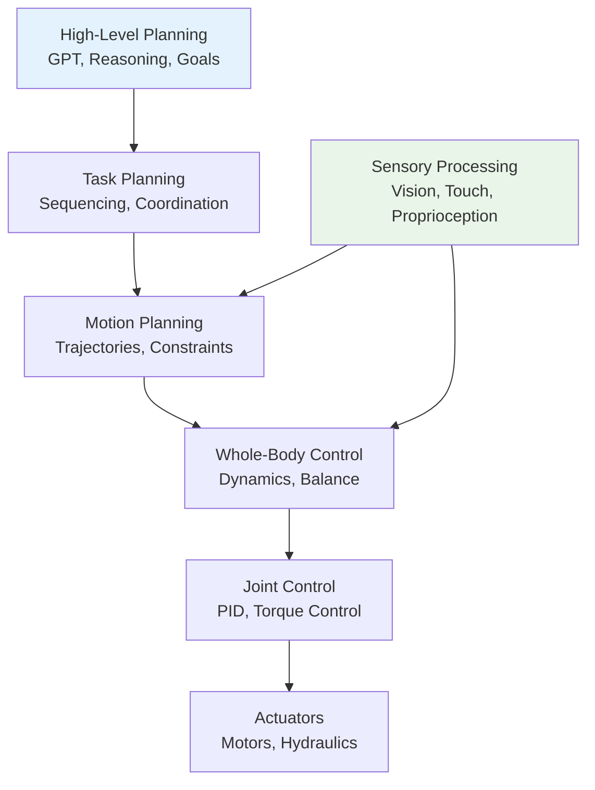

# Chapter 20: The Autonomous Humanoid

## 20.1 Introduction to Autonomous Humanoids

The autonomous humanoid represents the culmination of decades of research in robotics, artificial intelligence, and engineering. These systems aim to replicate human-like capabilities in perception, locomotion, manipulation, cognition, and social interaction. Unlike traditional robots that excel at specific tasks, autonomous humanoids are designed to operate adaptively in unstructured human environments.

### 20.1.1 Definition and Scope

An autonomous humanoid robot is a bipedal robot with human-like morphology and capabilities that can:

1. **Navigate complex environments** using bipedal locomotion
2. **Manipulate objects** with human-like dexterity
3. **Perceive and understand** the world through multiple sensors
4. **Reason and plan** using artificial intelligence
5. **Interact socially** with humans through natural communication
6. **Learn and adapt** from experience

### 20.1.2 Historical Evolution



### 20.1.3 Current State of the Art

**Leading Platforms:**
- **Boston Dynamics Atlas**: Advanced dynamic mobility and manipulation
- **Toyota T-HR3**: Human-robot teleoperation with haptic feedback
- **UBTECH Walker**: Bipedal locomotion with object manipulation
- **Agility Robotics Digit**: Commercial-ready bipedal robot
- **Figure AI Figure-01**: Humanoid for manufacturing and logistics

## 20.2 System Architecture

### 20.2.1 Hierarchical Control Architecture

Autonomous humanoids require sophisticated hierarchical control architectures that integrate low-level motor control with high-level cognitive planning.



### 20.2.2 Integrated Software Architecture

```python
class AutonomousHumanoid:
    def __init__(self, config):
        # Core subsystems
        self.perception = PerceptionSystem(config["perception"])
        self.locomotion = LocomotionSystem(config["locomotion"])
        self.manipulation = ManipulationSystem(config["manipulation"])
        self.cognition = CognitiveSystem(config["cognition"])
        self.communication = CommunicationSystem(config["communication"])

        # Integration and coordination
        self.behavior_controller = BehaviorController()
        self.safety_monitor = SafetySystem()
        self.energy_manager = EnergyManagementSystem()

        # Learning and adaptation
        self.learning_system = LearningSystem()
        self.adaptation_module = AdaptationModule()

        # State management
        self.state = RobotState()
        self.goals = GoalManager()

    def step(self):
        """Main control loop"""
        # Update perception
        sensory_data = self.perception.update()

        # Update internal state
        self.state.update(sensory_data)

        # Cognitive processing
        if self.cognition.should_replan():
            new_plan = self.cognition.replan(
                self.goals.active_goals(),
                self.state.current_state()
            )
            self.behavior_controller.update_plan(new_plan)

        # Generate behavior
        commands = self.behavior_controller.generate_commands(
            self.state, self.goals
        )

        # Safety validation
        safe_commands = self.safety_monitor.validate(commands)

        # Execute commands
        self.execute_commands(safe_commands)

        # Learning update
        self.learning_system.update(
            sensory_data, commands, self.state
        )

    def execute_commands(self, commands):
        """Execute validated commands"""
        for command in commands:
            if command["type"] == "locomotion":
                self.locomotion.execute(command["parameters"])
            elif command["type"] == "manipulation":
                self.manipulation.execute(command["parameters"])
            elif command["type"] == "communication":
                self.communication.execute(command["parameters"])
```

## 20.3 Integrated Perception System

### 20.3.1 Multimodal Sensor Fusion

```python
class IntegratedPerceptionSystem:
    def __init__(self):
        # Visual sensors
        self.rgb_cameras = MultiCameraSystem()
        self.depth_sensors = DepthSensorArray()
        self.event_cameras = EventCameraSystem()

        # Proprioception
        self.joint_encoders = JointEncoderSystem()
        self.imu_system = IMUArray()
        self.force_torque_sensors = ForceTorqueSensorArray()

        # Tactile sensing
        self.skin_sensors = DistributedSkinSystem()
        self.fingertip_sensors = FingertipSensorArray()

        # Environmental sensors
        self.lidar_sensors = LidarSystem()
        self.microphone_array = MicrophoneArray()
        self.environmental_sensors = EnvironmentalSensorArray()

        # Fusion architecture
        self.sensor_fusion = MultiModalFusion()
        self.attention_system = AttentionSystem()

    def perceive(self):
        """Integrate all sensory inputs"""
        # Collect raw sensor data
        visual_data = self.rgb_cameras.capture()
        depth_data = self.depth_sensors.capture()
        proprioceptive_data = self.get_proprioception()
        tactile_data = self.skin_sensors.get_contact_info()

        # Fuse multimodal data
        fused_perception = self.sensor_fusion.fuse({
            "vision": self.process_vision(visual_data, depth_data),
            "proprioception": proprioceptive_data,
            "touch": tactile_data,
            "audio": self.microphone_array.capture(),
            "environment": self.environmental_sensors.read()
        })

        # Generate attention-weighted perception
        attended_perception = self.attention_system.process(
            fused_perception, self.current_goal
        )

        return attended_perception

    def process_vision(self, rgb_data, depth_data):
        """Process visual information"""
        # Object detection and segmentation
        objects = self.rgb_cameras.detect_objects(rgb_data)
        depth_map = self.depth_sensors.process_depth(depth_data)

        # 3D reconstruction
        point_cloud = self.reconstruct_3d_scene(objects, depth_map)

        # Semantic understanding
        semantic_map = self.build_semantic_map(objects, point_cloud)

        return {
            "objects": objects,
            "depth_map": depth_map,
            "point_cloud": point_cloud,
            "semantic_map": semantic_map
        }
```

### 20.3.2 Situational Awareness

```python
class SituationalAwareness:
    def __init__(self):
        self.context_tracker = ContextTracker()
        self.change_detector = ChangeDetector()
        self.predictor = ScenePredictor()

    def update_awareness(self, perception, previous_state):
        """Update situational awareness"""
        # Detect changes
        changes = self.change_detector.detect(
            perception, previous_state["perception"]
        )

        # Update context
        context = self.context_tracker.update(
            perception, changes, previous_state["context"]
        )

        # Predict future states
        predictions = self.predictor.predict(context, perception)

        # Generate awareness report
        awareness = {
            "current_state": perception,
            "changes": changes,
            "context": context,
            "predictions": predictions,
            "attention_targets": self.select_attention_targets(
                perception, predictions
            )
        }

        return awareness
```

## 20.4 Advanced Locomotion System

### 20.4.1 Dynamic Bipedal Walking

```python
class DynamicBipedalController:
    def __init__(self):
        # Walking generators
        self.central_pattern_generator = CPGLocomotion()
        self.reflex_controller = ReflexController()

        # Balance and stability
        self.zmp_controller = ZMPController()
        self.momentum_controller = MomentumController()

        # Terrain adaptation
        self.terrain_classifier = TerrainClassifier()
        self.footstep_planner = AdaptiveFootstepPlanner()

        # Whole-body coordination
        self.whole_body_controller = WholeBodyController()

    def generate_walking_trajectory(self, desired_velocity, terrain_info):
        """Generate dynamic walking trajectory"""
        # Classify terrain
        terrain_type = self.terrain_classifier.classify(terrain_info)

        # Adapt walking parameters
        if terrain_type == "flat":
            gait_params = self.get_flat_gait_params()
        elif terrain_type == "uneven":
            gait_params = self.get_uneven_gait_params()
        elif terrain_type == "stairs":
            gait_params = self.get_stair_gait_params()

        # Generate stepping pattern
        stepping_pattern = self.central_pattern_generator.generate(
            desired_velocity, gait_params
        )

        # Plan footstep positions
        footsteps = self.footstep_planner.plan_footsteps(
            stepping_pattern, terrain_info
        )

        # Generate whole-body trajectory
        body_trajectory = self.whole_body_controller.plan_trajectory(
            footsteps, desired_velocity
        )

        return {
            "footsteps": footsteps,
            "body_trajectory": body_trajectory,
            "gait_parameters": gait_params
        }

    def maintain_balance(self, state, external_forces):
        """Maintain balance under perturbations"""
        # Calculate Zero Moment Point
        zmp = self.calculate_zmp(state)

        # Determine balance strategy
        if self.is_stable(zmp):
            # Ankle strategy
            correction = self.ankle_strategy(zmp)
        elif self.can_use_hip_strategy(state):
            # Hip strategy
            correction = self.hip_strategy(zmp, state)
        else:
            # Step strategy
            correction = self.step_strategy(zmp, state)

        # Apply reflex corrections
        reflex_correction = self.reflex_controller.generate_correction(
            external_forces, state
        )

        return correction + reflex_correction
```

### 20.4.2 Agile Locomotion

```python
class AgileLocomotionController:
    def __init__(self):
        self.jump_controller = JumpController()
        self.run_controller = RunningController()
        self.agile_planner = AgileMotionPlanner()

    def execute_jump(self, target_position, obstacles):
        """Execute dynamic jump to target"""
        # Calculate jump parameters
        jump_params = self.calculate_jump_parameters(
            self.state.position, target_position, obstacles
        )

        # Generate takeoff trajectory
        takeoff_trajectory = self.generate_takeoff_trajectory(jump_params)

        # Generate flight trajectory
        flight_trajectory = self.generate_flight_trajectory(jump_params)

        # Generate landing trajectory
        landing_trajectory = self.generate_landing_trajectory(jump_params)

        # Execute jump
        self.execute_phase_sequence([
            ("crouch", takeoff_trajectory),
            ("flight", flight_trajectory),
            ("landing", landing_trajectory)
        ])

    def run_with_obstacles(self, path, speed_profile):
        """Run through obstacles"""
        # Classify obstacles
        obstacle_types = self.classify_obstacles(path)

        # Generate agile maneuvers
        maneuvers = []
        for i, obstacle in enumerate(obstacle_types):
            if obstacle["type"] == "low":
                maneuvers.append(("jump", obstacle["position"]))
            elif obstacle["type"] == "narrow":
                maneuvers.append(("sidestep", obstacle["position"]))
            elif obstacle["type"] == "high"]:
                maneuvers.append(("duck", obstacle["position"]))

        # Integrate running with maneuvers
        agile_trajectory = self.integrate_maneuvers(
            path, speed_profile, maneuvers
        )

        return agile_trajectory
```

## 20.5 Sophisticated Manipulation System

### 20.5.1 Human-like Grasping

```python
class HumanoidGraspingSystem:
    def __init__(self):
        # Hand systems
        self.left_hand = DexterousHand("left")
        self.right_hand = DexterousHand("right")

        # Grasp planning
        self.grasp_planner = GraspPlanner()
        self.manipulation_planner = ManipulationPlanner()

        # Tactile feedback
        self.tactile_processor = TactileProcessor()

        # Dual-arm coordination
        self.dual_arm_coordinator = DualArmCoordinator()

    def plan_humanoid_grasp(self, object, task_context):
        """Plan human-like grasp for object"""
        # Analyze object properties
        object_analysis = self.analyze_object_properties(object)

        # Determine grasp type based on task
        grasp_type = self.select_grasp_type(
            object_analysis, task_context
        )

        # Generate grasp candidates
        grasp_candidates = self.grasp_planner.generate_candidates(
            object, grasp_type
        )

        # Evaluate candidates using human-inspired metrics
        evaluated_grasps = self.evaluate_grasps_humanlike(
            grasp_candidates, object_analysis
        )

        # Select best grasp
        best_grasp = self.select_best_grasp(evaluated_grasps)

        return best_grasp

    def execute_bimanual_task(self, task, objects):
        """Execute bimanual manipulation task"""
        # Plan coordination
        coordination_plan = self.dual_arm_coordinator.plan_coordination(
            task, objects
        )

        # Execute synchronized motion
        for phase in coordination_plan["phases"]:
            if phase["type"] == "simultaneous":
                self.execute_simultaneous_action(
                    phase["left_action"],
                    phase["right_action"]
                )
            elif phase["type"] == "sequential":
                self.execute_sequential_actions(
                    phase["actions"],
                    phase["order"]
                )

            # Monitor and adapt
            self.monitor_and_adapt(phase)

        return True
```

### 20.5.2 Tool Use and Manipulation

```python
class ToolUseSystem:
    def __init__(self):
        self.tool_recognizer = ToolRecognizer()
        self.tool_grasp_planner = ToolGraspPlanner()
        self.action_executor = ToolActionExecutor()

    def use_tool(self, tool_name, action, target):
        """Execute tool use action"""
        # Recognize tool
        tool_info = self.tool_recognizer.identify_tool(tool_name)

        # Plan tool grasp
        grasp_config = self.tool_grasp_planner.plan_grasp(
            tool_info, action
        )

        # Grasp tool
        self.grasp_tool(tool_info, grasp_config)

        # Execute tool action
        self.action_executor.execute(tool_info, action, target)

        # Release tool
        self.release_tool()

    def learn_new_tool(self, tool_description, demonstration):
        """Learn to use new tool from demonstration"""
        # Extract tool properties
        tool_properties = self.extract_tool_properties(demonstration)

        # Learn affordances
        affordances = self.learn_tool_affordances(
            tool_description, tool_properties
        )

        # Store in tool knowledge base
        self.tool_knowledge.add_tool(
            tool_description, tool_properties, affordances
        )

        return affordances
```

## 20.6 Cognitive Architecture Integration

### 20.6.1 Unified Cognitive System

```python
class HumanoidCognitiveSystem:
    def __init__(self):
        # Language and reasoning
        self.language_model = GPTCognitiveModule()
        self.reasoning_engine = ReasoningEngine()

        # Memory systems
        self.episodic_memory = EpisodicMemory()
        self.semantic_memory = SemanticMemory()
        self.working_memory = WorkingMemory()

        # Learning systems
        self.skill_learner = SkillLearner()
        self.adaptation_learner = AdaptationLearner()

        # Decision making
        self.decision_maker = DecisionMaker()
        self.value_system = ValueSystem()

    def process_instruction(self, instruction, context):
        """Process natural language instruction"""
        # Parse instruction
        parsed_instruction = self.language_model.parse(instruction)

        # Retrieve relevant memories
        relevant_memories = self.episodic_memory.retrieve(
            parsed_instruction, context
        )

        # Generate understanding
        understanding = self.reasoning_engine.understand(
            parsed_instruction, context, relevant_memories
        )

        # Create goals
        goals = self.create_goals(understanding)

        # Plan actions
        plan = self.plan_actions(goals, context)

        return {
            "understanding": understanding,
            "goals": goals,
            "plan": plan,
            "confidence": understanding["confidence"]
        }

    def reflect_on_experience(self, experience, outcome):
        """Reflect on experience to learn"""
        # Store in episodic memory
        self.episodic_memory.store(experience, outcome)

        # Extract lessons
        lessons = self.extract_lessons(experience, outcome)

        # Update semantic memory
        for lesson in lessons:
            self.semantic_memory.update(lesson)

        # Update policies
        if outcome["success"]:
            self.reinforce_successful_behavior(experience)
        else:
            self.identify_and_correct_failure(experience, outcome)
```

### 20.6.2 Social Cognition

```python
class SocialCognitionSystem:
    def __init__(self):
        self.emotion_recognizer = EmotionRecognizer()
        self.intention_detector = IntentionDetector()
        self.social_planner = SocialPlanner()

    def understand_social_context(self, people, environment):
        """Understand social context"""
        # Recognize emotions
        emotions = {}
        for person in people:
            emotions[person["id"]] = self.emotion_recognizer.recognize(
                person["facial_expression"],
                person["body_language"],
                person["voice"]
            )

        # Detect intentions
        intentions = {}
        for person in people:
            intentions[person["id"]] = self.intention_detector.detect(
                person["actions"],
                person["gaze"],
                person["speech"]
            )

        # Plan socially appropriate behavior
        social_plan = self.social_planner.plan_behavior(
            emotions, intentions, environment
        )

        return {
            "emotions": emotions,
            "intentions": intentions,
            "social_plan": social_plan
        }

    def engage_in_conversation(self, topic, participants):
        """Engage in natural conversation"""
        # Understand conversation context
        context = self.understand_conversation_context(topic, participants)

        # Generate responses
        while context["active"]:
            # Listen and understand
            user_input = self.listen()
            understanding = self.process_speech(user_input)

            # Generate appropriate response
            response = self.generate_response(
                understanding, context, participants
            )

            # Respond verbally and non-verbally
            self.speak(response["speech"])
            self.express(response["non_verbal"])

            # Update context
            context = self.update_context(understanding, response)

        return context
```

## 20.7 Learning and Adaptation

### 20.7.1 Continuous Learning System

```python
class ContinuousLearningSystem:
    def __init__(self):
        self.skill_repository = SkillRepository()
        self.experience_buffer = ExperienceBuffer()
        self.meta_learner = MetaLearner()

    def learn_from_interaction(self, interaction):
        """Learn continuously from interactions"""
        # Store experience
        self.experience_buffer.add(interaction)

        # Identify learning opportunities
        learning_opportunities = self.identify_learning_opportunities(
            interaction
        )

        # Update skills
        for opportunity in learning_opportunities:
            if opportunity["type"] == "new_skill":
                self.learn_new_skill(opportunity)
            elif opportunity["type"] == "skill_refinement":
                self.refine_skill(opportunity)
            elif opportunity["type"] == "knowledge_update":
                self.update_knowledge(opportunity)

        # Meta-learning
        self.meta_learner.update(interaction)

    def adapt_to_environment(self, environment_changes):
        """Adapt to changing environments"""
        # Analyze changes
        change_analysis = self.analyze_environment_changes(environment_changes)

        # Determine adaptation strategies
        adaptation_strategies = self.select_adaptation_strategies(
            change_analysis
        )

        # Execute adaptations
        for strategy in adaptation_strategies:
            if strategy["type"] == "parameter_update":
                self.update_parameters(strategy["updates"])
            elif strategy["type"] == "behavior_modification":
                self.modify_behavior(strategy["changes"])
            elif strategy["type"] == "new_capability":
                self.acquire_new_capability(strategy["capability"])

        return adaptation_strategies
```

### 20.7.2 Transfer Learning

```python
class TransferLearningSystem:
    def __init__(self):
        self.source_domains = DomainKnowledgeBase()
        self.transfer_analyzer = TransferAnalyzer()
        self.adapter = DomainAdapter()

    def transfer_knowledge(self, source_domain, target_domain):
        """Transfer knowledge between domains"""
        # Analyze domain similarity
        similarity = self.transfer_analyzer.analyze_similarity(
            source_domain, target_domain
        )

        # Select transferable knowledge
        transferable = self.select_transferable_knowledge(
            source_domain, similarity
        )

        # Adapt knowledge for target domain
        adapted_knowledge = self.adapter.adapt_knowledge(
            transferable, source_domain, target_domain
        )

        # Validate transfer
        validation = self.validate_transfer(
            adapted_knowledge, target_domain
        )

        if validation["success"]:
            self.integrate_knowledge(adapted_knowledge)
        else:
            self.refine_transfer(adapted_knowledge, validation)

        return adapted_knowledge
```

## 20.8 Energy and Resource Management

### 20.8.1 Energy Optimization

```python
class EnergyManagementSystem:
    def __init__(self):
        self.energy_monitor = EnergyMonitor()
        self.optimization_planner = EnergyOptimizationPlanner()
        self.power_distributor = PowerDistributor()

    def optimize_energy_consumption(self, tasks, constraints):
        """Optimize energy for task execution"""
        # Predict energy requirements
        energy_requirements = self.predict_energy_requirements(tasks)

        # Optimize task scheduling
        optimized_schedule = self.optimization_planner.optimize_schedule(
            tasks, energy_requirements, constraints
        )

        # Optimize movement patterns
        optimized_movements = self.optimize_movements(
            optimized_schedule["movements"]
        )

        # Manage power distribution
        power_distribution = self.power_distributor.plan_distribution(
            optimized_schedule
        )

        return {
            "schedule": optimized_schedule,
            "movements": optimized_movements,
            "power_distribution": power_distribution
        }

    def manage_charging_cycle(self, current_charge, upcoming_tasks):
        """Manage autonomous charging"""
        # Predict energy needs
        energy_needs = self.predict_upcoming_energy_needs(upcoming_tasks)

        # Plan charging
        if current_charge < energy_needs["required"]:
            charging_plan = self.plan_charging_cycle(
                current_charge, energy_needs
            )
            return charging_plan

        return {"action": "continue_operation"}
```

### 20.8.2 Resource Allocation

```python
class ResourceManagementSystem:
    def __init__(self):
        self.resource_monitor = ResourceMonitor()
        self.allocation_planner = ResourceAllocationPlanner()

    def allocate_computational_resources(self, tasks):
        """Allocate computational resources efficiently"""
        # Analyze task requirements
        task_requirements = self.analyze_task_requirements(tasks)

        # Check current resource availability
        available_resources = self.resource_monitor.get_available_resources()

        # Allocate resources
        allocation = self.allocation_planner.allocate(
            task_requirements, available_resources
        )

        # Monitor and adjust
        self.monitor_resource_usage(allocation)

        return allocation
```

## 20.9 Safety and Reliability

### 20.9.1 Multi-Layer Safety System

```python
class MultiLayerSafetySystem:
    def __init__(self):
        # Safety layers
        self.emergency_stop = EmergencyStopSystem()
        self.predictive_safety = PredictiveSafetySystem()
        self.reactive_safety = ReactiveSafetySystem()

        # Monitoring
        self.safety_monitor = SafetyMonitor()
        self.risk_assessor = RiskAssessor()

    def ensure_safety(self, planned_action, current_state):
        """Ensure action safety across all layers"""
        # Layer 1: Predictive safety
        prediction = self.predictive_safety.predict_outcome(
            planned_action, current_state
        )

        if prediction["risk"] > self.safety_thresholds["predictive"]:
            return self.prevent_unsafe_action(
                planned_action, prediction["hazards"]
            )

        # Layer 2: Reactive safety
        safety_checks = self.reactive_safety.check_action_safety(
            planned_action, current_state
        )

        if not safety_checks["safe"]:
            return self.modify_action_for_safety(
                planned_action, safety_checks["violations"]
            )

        # Layer 3: Emergency stop ready
        self.emergency_stop.prepare_emergency_response(
            planned_action
        )

        return {"safe": True, "action": planned_action}

    def handle_emergency(self, emergency_type, details):
        """Handle emergency situations"""
        # Activate emergency protocols
        self.emergency_stop.activate(emergency_type)

        # Notify humans
        self.notify_emergency(emergency_type, details)

        # Enter safe state
        self.enter_safe_state()

        # Generate recovery plan
        recovery_plan = self.generate_recovery_plan(
            emergency_type, details
        )

        return recovery_plan
```

### 20.9.2 Reliability and Fault Tolerance

```python
class ReliabilitySystem:
    def __init__(self):
        self.health_monitor = HealthMonitor()
        self.fault_detector = FaultDetector()
        self.recovery_manager = RecoveryManager()

    def ensure_reliability(self):
        """Continuous reliability management"""
        # Monitor system health
        health_status = self.health_monitor.check_all_systems()

        # Detect faults
        faults = self.fault_detector.detect_anomalies(health_status)

        # Handle faults
        for fault in faults:
            if fault["severity"] == "critical":
                self.handle_critical_fault(fault)
            elif fault["severity"] == "warning":
                self.handle_warning_fault(fault)

            # Log fault
            self.log_fault(fault)

    def graceful_degradation(self, failed_components):
        """Gracefully degrade functionality"""
        # Reconfigure system
        reconfiguration = self.plan_reconfiguration(failed_components)

        # Apply reconfiguration
        self.apply_reconfiguration(reconfiguration)

        # Update capabilities
        self.update_capabilities(reconfiguration["affected_capabilities"])

        return reconfiguration
```

## 20.10 Real-World Applications

### 20.10.1 Home Assistance

```python
class HomeAssistantHumanoid:
    def __init__(self):
        self.house_knowledge = HouseKnowledgeBase()
        self.task_scheduler = TaskScheduler()
        self.human_interaction = HumanInteractionSystem()

    def assist_in_home(self, resident_preferences):
        """Provide assistance in home environment"""
        # Learn home layout
        self.learn_home_layout()

        # Understand resident routines
        self.learn_routines(resident_preferences)

        # Proactive assistance
        while True:
            # Monitor for assistance needs
            needs = self.detect_assistance_needs()

            # Provide assistance
            for need in needs:
                if need["type"] == "cleaning":
                    self.perform_cleaning_task(need)
                elif need["type"] == "assistance":
                    self.provide_personal_assistance(need)
                elif need["type"] == "emergency":
                    self.handle_emergency(need)

            # Learn from interactions
            self.learn_from_daily_interactions()
```

### 20.10.2 Industrial Workforce

```python
class IndustrialHumanoid:
    def __init__(self):
        self.task_knowledge = IndustrialTaskKnowledge()
        self.safety_compliance = SafetyComplianceSystem()
        self.quality_control = QualityControlSystem()

    def work_in_factory(self, work_instructions):
        """Work in industrial environment"""
        # Verify safety conditions
        self.safety_compliance.verify_environment()

        # Execute tasks
        for task in work_instructions:
            # Plan execution
            execution_plan = self.plan_task_execution(task)

            # Execute with monitoring
            result = self.execute_with_monitoring(execution_plan)

            # Quality check
            quality_result = self.quality_control.inspect(result)

            # Adapt if needed
            if not quality_result["passed"]:
                self.adapt_execution(task, quality_result)
```

## 20.11 Future Directions and Challenges

### 20.11.1 Emerging Technologies

**Brain-Inspired Computing:**
- Neuromorphic processors for efficient neural computation
- Spiking neural networks for temporal processing
- Brain-machine interfaces for intuitive control

**Advanced Materials:**
- Self-healing materials for durability
- Variable stiffness actuators for compliance
- Bio-inspired sensors for enhanced perception

**Quantum Integration:**
- Quantum optimization for planning
- Quantum machine learning for cognition
- Quantum sensing for precise measurement

### 20.11.2 Open Challenges

**Energy Efficiency:**
- Biological-level energy efficiency
- Long-term autonomous operation
- Rapid recharging technologies

**Robustness:**
- Handling unexpected situations
- Recovery from damage
- Adapting to novel environments

**Social Integration:**
- Natural human-robot interaction
- Cultural awareness and sensitivity
- Ethical decision making

**Scalability:**
- Manufacturing at scale
- Cost reduction
- Standardization and interoperability

## 20.12 Conclusion

The autonomous humanoid represents one of the most ambitious goals in robotics and artificial intelligence. By integrating advanced perception, locomotion, manipulation, cognition, and social interaction capabilities, these systems promise to transform how we work and live.

The path to truly autonomous humanoids requires continued advances across multiple domains:

1. **Hardware innovations** in sensors, actuators, and energy systems
2. **Software architectures** that can integrate diverse capabilities
3. **Learning systems** that enable adaptation and improvement
4. **Safety frameworks** that ensure reliable operation
5. **Social understanding** that enables natural interaction

As these technologies mature, autonomous humanoids will increasingly collaborate with humans in homes, workplaces, and public spaces, augmenting human capabilities rather than replacing them. The future of autonomous humanoids lies in human-robot partnership rather than automation alone.

### Key Takeaways:

1. **System integration** is the primary challenge in creating autonomous humanoids
2. **Hierarchical architectures** enable coordination across different levels of control
3. **Learning and adaptation** are essential for operating in unstructured environments
4. **Safety and reliability** must be designed from the ground up
5. **Social cognition** enables natural human-robot interaction
6. **Energy management** is crucial for practical deployment
7. **Continuous improvement** through experience is necessary for long-term autonomy

The next decade will likely see significant progress in autonomous humanoid capabilities, bringing us closer to the long-held vision of robots that can work alongside humans as capable partners and assistants.

## Further Reading

- "The Whole-Body Control of Humanoid Robots" (Kajita et al., 2024)
- "Deep Learning for Robotic Grasping" (Levine et al., 2023)
- "Humanoid Robotics: A Reference" (Niku, 2023)
- "Cognitive Architectures for Humanoid Robots" (Vernon, 2024)
- "Safe Reinforcement Learning for Humanoid Robots" (Garcia & Fernandez, 2023)

## Exercises

### Exercise 1: System Integration Design
Design the integration architecture for a specific humanoid application (e.g., home assistance, manufacturing). Detail how different subsystems interact.

### Exercise 2: Safety Analysis
Conduct a comprehensive safety analysis for a humanoid robot operating in public spaces. Identify potential hazards and design mitigation strategies.

### Exercise 3: Energy Optimization
Develop an energy management strategy that maximizes operational time while maintaining performance.

### Exercise 4: Social Interaction Design
Design natural interaction protocols for humanoid robots assisting elderly users in their homes.

### Exercise 5: Learning Scenario
Design a learning scenario where a humanoid robot learns a new household task through demonstration and practice.