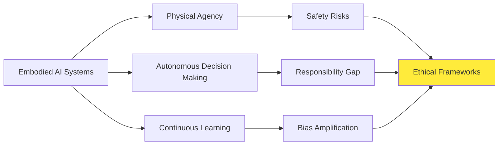
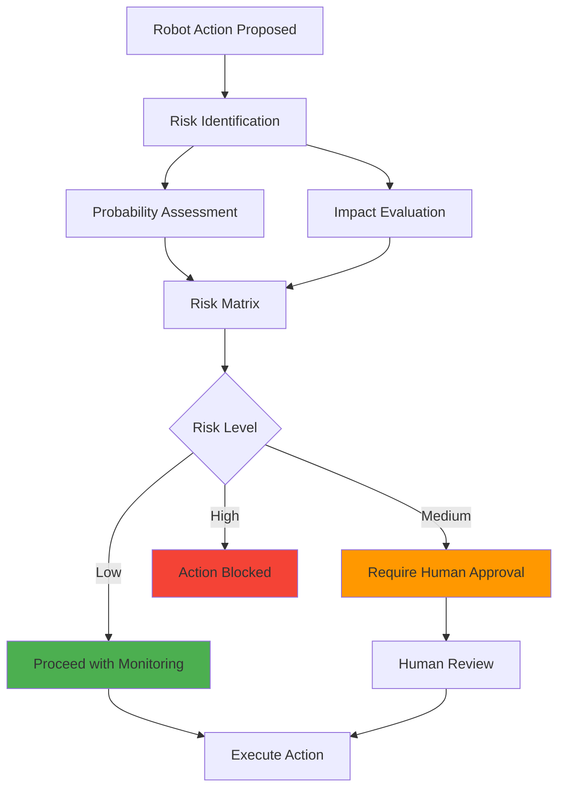
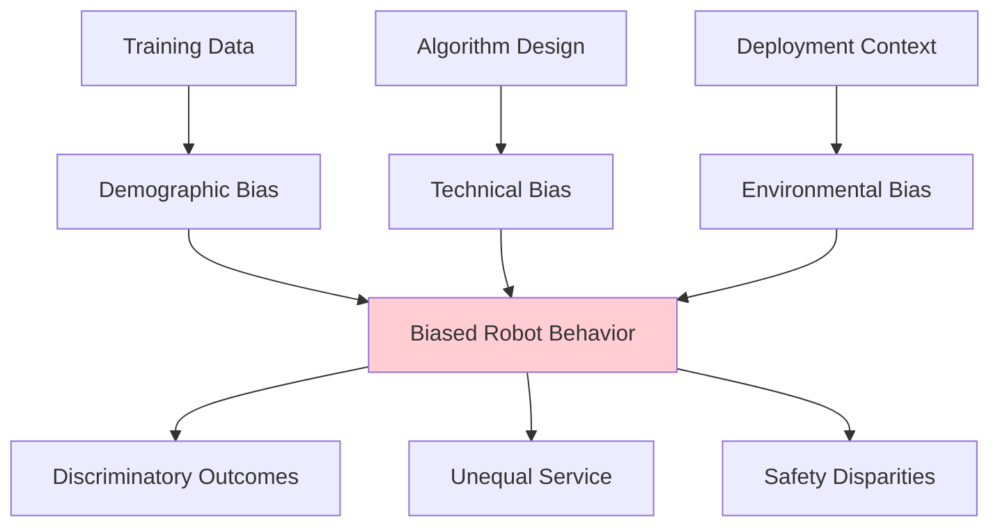
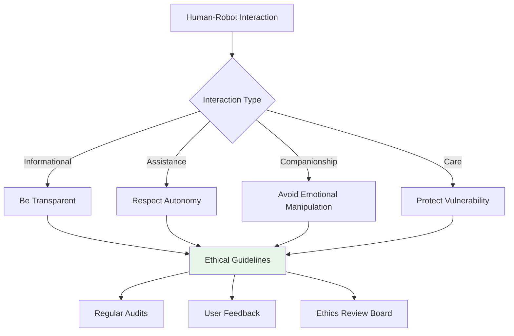

# Chapter 21: Ethical Considerations in Embodied AI

## 21.1 Introduction to AI Ethics in Physical Systems

As embodied AI systems become increasingly sophisticated and integrated into human environments, the ethical considerations surrounding their development and deployment become paramount. Unlike purely digital AI systems, embodied AI robots interact with the physical world, making decisions that can have immediate and lasting consequences on human safety, privacy, and social dynamics.

### 21.1.1 The Unique Challenges of Embodied AI Ethics



The integration of AI systems into physical robots introduces unique ethical challenges:

1. **Physical Safety**: Autonomous robots can cause physical harm to humans and property
2. **Privacy Concerns**: Robots with sensors can collect vast amounts of personal data
3. **Autonomy vs Control**: Balancing robot independence with human oversight
4. **Bias and Fairness**: Ensuring equitable treatment across different demographics
5. **Accountability**: Determining responsibility for robot actions and decisions

## 21.2 Safety Frameworks and Risk Assessment

### 21.2.1 The Asimov Principles and Modern Interpretations

While Asimov's Three Laws of Robotics provide a foundational framework for robot ethics, modern embodied AI systems require more nuanced approaches:

```python
class ModernRoboticsEthics:
    """
    Implementation of modern ethical guidelines for embodied AI systems
    """
    def __init__(self):
        self.safety_constraints = {
            'human_safety_priority': 1.0,  # Highest priority
            'property_protection': 0.8,
            'task_completion': 0.6,
            'self_preservation': 0.4  # Never override human safety
        }

    def evaluate_action(self, action, context):
        """Evaluate if an action meets ethical constraints"""
        risk_score = self.calculate_risk(action, context)

        if risk_score['human_safety'] > 0.1:  # 10% risk threshold
            return False, "Unacceptable human safety risk"

        if risk_score['privacy'] > 0.3:  # 30% privacy risk threshold
            return False, "Unacceptable privacy risk"

        return True, "Action approved"

    def calculate_risk(self, action, context):
        """Calculate comprehensive risk assessment"""
        # Implementation of risk calculation logic
        pass
```

### 21.2.2 Risk Assessment Methodologies



## 21.3 Privacy in Embodied AI Systems

### 21.3.1 Data Collection and Surveillance Concerns

Embodied AI systems often operate in private spaces and collect vast amounts of data through various sensors:

1. **Visual Data**: Cameras capturing video and images of private spaces
2. **Audio Data**: Microphones recording conversations and ambient sounds
3. **Location Data**: Tracking movement patterns and behaviors
4. **Interaction Data**: Recording human-robot interactions

```python
class PrivacyManager:
    """Manages privacy-preserving features in embodied AI systems"""

    def __init__(self, privacy_level='high'):
        self.privacy_presets = {
            'minimal': {
                'video_recording': False,
                'audio_recording': False,
                'location_tracking': False
            },
            'standard': {
                'video_recording': True,
                'audio_recording': False,
                'location_tracking': True,
                'retention_days': 7
            },
            'high': {
                'video_recording': True,
                'audio_recording': True,
                'location_tracking': True,
                'retention_days': 30,
                'encryption_required': True
            }
        }
        self.current_settings = self.privacy_presets[privacy_level]

    def anonymize_data(self, data):
        """Apply anonymization techniques to collected data"""
        # Implement facial blurring, voice modification, etc.
        pass

    def get_consent(self, data_type, purpose):
        """Obtain explicit user consent for data collection"""
        # Implement consent management
        pass
```

### 21.3.2 Privacy-Preserving Technologies

1. **Federated Learning**: Training models locally without data centralization
2. **Differential Privacy**: Adding noise to protect individual privacy
3. **Edge Computing**: Processing data locally on the robot
4. **Homomorphic Encryption**: Computing on encrypted data

## 21.4 Bias and Fairness in Embodied AI

### 21.4.1 Sources of Bias in Robotic Systems



Common sources of bias in embodied AI:

1. **Data Bias**: Underrepresentation of certain demographics in training data
2. **Algorithmic Bias**: Design choices that favor certain groups
3. **Contextual Bias**: Assumptions about deployment environments
4. **Interaction Bias**: Robots learning from biased human interactions

### 21.4.2 Mitigation Strategies

```python
class FairnessAuditor:
    """Audits and mitigates bias in embodied AI systems"""

    def __init__(self):
        self.protected_attributes = ['age', 'gender', 'race', 'ability']
        self.fairness_metrics = [
            'demographic_parity',
            'equal_opportunity',
            'equalized_odds'
        ]

    def audit_model(self, model, test_data):
        """Comprehensive fairness audit"""
        results = {}
        for metric in self.fairness_metrics:
            results[metric] = self.calculate_fairness_metric(
                model, test_data, metric
            )

        return self.generate_fairness_report(results)

    def mitigate_bias(self, model, bias_type):
        """Apply bias mitigation techniques"""
        if bias_type == 'preprocessing':
            return self.apply_preprocessing_mitigation(model)
        elif bias_type == 'inprocessing':
            return self.apply_inprocessing_mitigation(model)
        elif bias_type == 'postprocessing':
            return self.apply_postprocessing_mitigation(model)
```

## 21.5 Accountability and Transparency

### 21.5.1 The Black Box Problem in Robotics

Embodied AI systems often operate as black boxes, making it difficult to understand their decision-making processes. This lack of transparency poses challenges for:

1. **Incident Investigation**: Understanding robot failures and accidents
2. **Legal Responsibility**: Determining liability for robot actions
3. **Public Trust**: Building confidence in autonomous systems
4. **Regulatory Compliance**: Meeting safety and ethics standards

### 21.5.2 Explainable AI for Robotics

```python
class ExplainableRobotics:
    """Implementing XAI techniques for embodied systems"""

    def __init__(self):
        self.explanation_methods = {
            'attention_visualization': self.visualize_attention,
            'decision_tree_extraction': self.extract_decision_rules,
            'counterfactual_explanations': self.generate_counterfactuals,
            'feature_importance': self.calculate_feature_importance
        }

    def explain_decision(self, action, context, method='attention'):
        """Generate human-readable explanation for robot decision"""
        if method in self.explanation_methods:
            return self.explanation_methods[method](action, context)
        else:
            return self.default_explanation(action, context)

    def generate_decision_log(self, action_sequence):
        """Create comprehensive log of robot decisions"""
        log_entry = {
            'timestamp': datetime.now(),
            'sensory_input': self.process_sensory_data(),
            'internal_state': self.get_internal_state(),
            'decision_made': action_sequence,
            'rationale': self.explain_decision(action_sequence),
            'confidence': self.calculate_confidence()
        }
        return log_entry
```

## 21.6 Human-Robot Interaction Ethics

### 21.6.1 Emotional Manipulation and Deception

As robots become more sophisticated in their ability to understand and mimic human emotions, ethical concerns arise about:

1. **Emotional Manipulation**: Using emotional responses to influence human behavior
2. **Deceptive Capabilities**: Robots misrepresenting their nature or intentions
3. **Attachment Formation**: Humans developing inappropriate emotional bonds
4. **Vulnerability Exploitation**: Targeting vulnerable populations

### 21.6.2 Ethical Interaction Guidelines



## 21.7 Regulatory Frameworks and Standards

### 21.7.1 Current Regulatory Landscape

The regulation of embodied AI systems is evolving globally with various approaches:

1. **European Union**: AI Act with specific provisions for high-risk AI systems
2. **United States**: Sector-specific regulations and voluntary guidelines
3. **Asia-Pacific**: Varied approaches from strict regulation to industry self-governance
4. **International Standards**: ISO/IEC standards for robotics and AI safety

### 21.7.2 Compliance Framework

```python
class RegulatoryCompliance:
    """Ensures compliance with global AI and robotics regulations"""

    def __init__(self, jurisdiction='EU'):
        self.regulations = {
            'EU': {
                'risk_categories': ['minimal', 'limited', 'high', 'unacceptable'],
                'requirements': {
                    'high_risk': [
                        'risk_management_system',
                        'data_governance',
                        'technical_documentation',
                        'transparency_provisions',
                        'human_oversight',
                        'accuracy_reliability'
                    ]
                }
            },
            'US': {
                'guidelines': [
                    'NIST_AI_Risk_Management_Framework',
                    'FDA_robotic_device_guidelines',
                    'OSHA_workplace_safety'
                ]
            }
        }
        self.current_regime = self.regulations[jurisdiction]

    def assess_compliance(self, system):
        """Assess system compliance against regulatory requirements"""
        compliance_score = 0
        requirements_met = []

        for requirement in self.current_regime['requirements']['high_risk']:
            if self.check_requirement(system, requirement):
                compliance_score += 1
                requirements_met.append(requirement)

        return {
            'compliance_percentage': (compliance_score / len(self.current_regime['requirements']['high_risk'])) * 100,
            'requirements_met': requirements_met,
            'gaps': self.identify_compliance_gaps(system)
        }
```

## 21.8 Future Ethical Challenges

### 21.8.1 Emerging Technologies and New Dilemmas

As embodied AI technology advances, new ethical challenges will emerge:

1. **Brain-Computer Interfaces**: Direct neural control of robots
2. **Swarm Robotics**: Coordinated behavior of multiple robots
3. **Self-Reproducing Robots**: Robots that can create other robots
4. **Android Rights**: Legal and moral status of highly advanced robots

### 21.8.2 Preparing for the Future

```python
class FutureEthicsFramework:
    """Adaptive ethics framework for emerging embodied AI technologies"""

    def __init__(self):
        self.ethical_principles = {
            'beneficence': 'Promote human wellbeing',
            'non_maleficence': 'Avoid harm to humans',
            'autonomy': 'Respect human agency',
            'justice': 'Ensure fair treatment',
            'accountability': 'Maintain transparency'
        }

    def evaluate_new_technology(self, tech_description):
        """Evaluate emerging technologies against ethical principles"""
        ethical_impact = {}

        for principle, description in self.ethical_principles.items():
            ethical_impact[principle] = self.assess_principle_impact(
                tech_description, principle
            )

        return self.generate_ethical_recommendation(ethical_impact)

    def update_framework(self, new_case_study):
        """Continuously update ethical framework based on real-world cases"""
        # Learn from new ethical challenges and update guidelines
        pass
```

## 21.9 Conclusion

The ethical development and deployment of embodied AI systems requires ongoing attention and adaptation. As these systems become more capable and integrated into society, the importance of robust ethical frameworks becomes increasingly critical. By proactively addressing these challenges, we can ensure that embodied AI technologies benefit humanity while minimizing risks and protecting human values.

Key takeaways:

1. **Safety First**: Human safety must always be the highest priority
2. **Privacy by Design**: Build privacy protections into systems from the start
3. **Fairness and Inclusion**: Actively work to eliminate bias and ensure equitable treatment
4. **Transparency and Accountability**: Maintain clear explanations for robot behavior
5. **Continuous Oversight**: Regular audits and updates to ethical frameworks
6. **Global Cooperation**: International standards and shared best practices

The future of embodied AI depends not just on technical innovation, but on our ability to develop these systems responsibly and ethically.